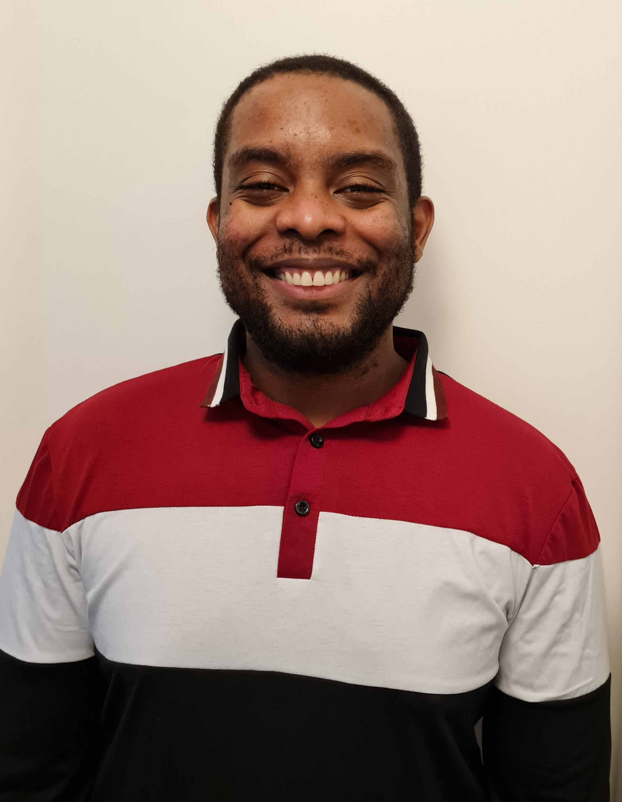

# About The Site

Hello and welcome. My name is Kedy Edme and 
am passionate about many things. One of my passions is science, 
in particular the physical sciences. I obtained a PhD in physical chemistry
but I can't seem to stop wanting to learn more physics and chemistry. 
I am particularly interested in the intersection of quantum mechanics
and chemistry (quantum chemistry and quantum dynamics
applied to chemistry). I have also been involved in education throughout my life. 
I have taught math, chemistry and physics in high school in Haiti, 
and entering college students in the US.  
This website is dedicated to personal projects that I want to share.
In particular:  
 
 

- Python projects simulating dynamics of simple quantum systems  
- My science blog creole  
- Miscellaneous science contents (in the form of slides) I made in order to teach myself,
but also to share if someone would want to learn these as well.  

## Current projects

- [Notes on Physical Science](/projects/Miscellaneous/miscellaneous.md)
- [Quantum dynamics with the dynamics](/projects/quantumdynamics/QDWD_intro.md)
- [My science blog in Haitian creole](/projects/ANPS/posts/Akey.md)
- [ANPS: my blog at old URL](https://anps.space/)

