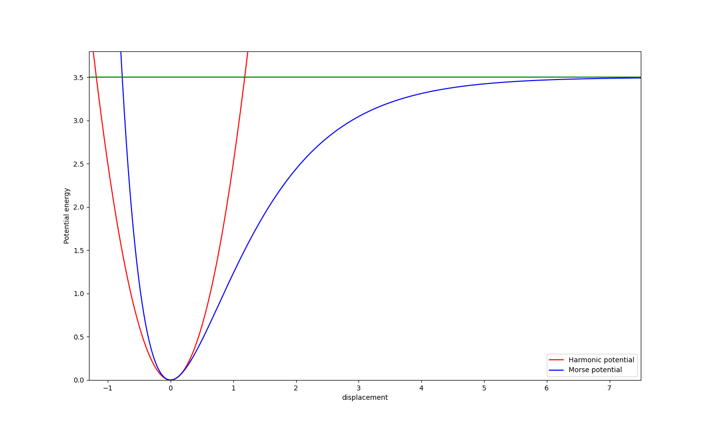

# Three Flavors of the Quantum Harmonic Oscillator
## Discussion of the Classical System
A harmonic oscillator is a physical system in which, the force required to restore the system to its equilibrium 
position is proportional to the displacement from equilibrium. Classically, the harmonic oscillator model is usually applied
to the oscillation about an equilibrium point of a mass attached to a spring.
In one dimension, if the equilibrium position is $x=0$, 
the restoring force will then be: 

$$
\begin{align}
\tag{1}
F_{x}=-kx
\end{align}
$$

where $k$ is the force constant, which can for example, be the stiffness of the spring.
The force being conservative (meaning that the work done by the force is independent of path, only dependent on the initial
and final position), we can determine the potential energy stored in the oscillator for a given displacement $x$. Indeed, in our 1-D case, the potential energy is related to a conservative force by the relation:

$$
\begin{align}
\tag{2}
\frac{dV}{dx}=-F_{x}
\end{align}
$$

As a result, we find that the potential energy stored in the oscillator is quadratic with respect to the displacement: 

$$
\begin{align}
\tag{3}
V=\frac{1}{2}kx^2
\end{align}
$$

For a classical system, in order to get the equation of motion for such an oscillator, we would need to solve Newton's second law of motion by setting the restoring force $F_{x}$ equal to the product of mass times acceleration (the second derivative of the position with respect to time):

$$
\begin{align}
\tag{4}
m\frac{d^2x}{dt^2}=-kx\\
\frac{d^2x}{dt^2}+\omega^2x=0
\end{align}
$$

notice that we have set $\frac{k}{m}=\omega^2$, where $\omega$ is the frequency of oscillation. Solving the ordinary second order differential equation leads to oscillatory solutions of position as a function of time of the type: $x(t) = A\cos{\left(\omega t\right)}$, for an initial displacement $A$ at $t=0$. I have outlined the steps to solving this differential equation [here]() for the interested reader.  

Solving equation 4 is important because it allows us to obtain a quantitative description of the motion of the oscillator as a function of time. In addition, there is no damping, in this example (no friction), taking away energy from the system. As a result it will oscillate forever. However, it is also very important to understand the relation between the shape of the potential, and the force acting on the system.  

Indeed we observe that, whatever the magnitude of the displacement, the potential energy of the system will always be given by equation 3. This observation means that the restoring force will always be able to compensate for the displacement, thereby causing our system to be "trapped" in this potential. In practice, we know this is not the case. We know that for a given amplitude, the spring will break. Hence, we understand that we can only maintain the interplay between the restoring force and the displacement for small enough displacements. But what does it mean for a displacement to be "small enough" ? We can better understand this by looking at a more realistic potential superimposed over the harmonic potential.  

In the following figure we display a so-called Morse potential, and a harmonic oscillator potential. As we have stated, we observe that if our system is a harmonic oscillator, it remains trap on the quadratic potential no matter the magnitude of the displacement. Furthermore, the values of the potential energy are symmetric about $+x$ and $-x$, since it is a even function $\left(V(x)=V(-x)\right)$. However, the Morse potential does not display such symmetry. Indeed, there is a treshold displacement at which the oscillator can escape the potential (i.e oscillator breaks). In this example, if the system accumulates a potential energy that is greater than $3.5$ energy units, it will escape the potential. The Morse potential is a more realistic model of the oscillators we are used to in practice. It is indeed used to model the vibrations of diatomic molecules.  

<figure>
    
    <figcaption>Figure 1. Harmonic oscillator potential energy curve (red) superimposed over the Morse potential energy curve (blue) as a function of displacement. The dissociation treshold for the Morse curve (green). The harmonic oscillator approximates the Morse potential at small displacement about the equilibrium point.   
</figcaption>
</figure>           

#### What about at small displacements?

We have shown that the harmonic oscillator model does not, in practice, appropriately capture the physics of an oscillator at large displacements. Most oscillators do not obey simple harmonic motion. However, we observe that at small enough displacement about the equilibrium displacement, $x=0$ in our case, the harmonic curve approximates the Morse potential. This observation can be generalized to any type of potential describing oscillatory motion. We can always approximate such a potential with the harmonic oscillator potential about an equilibrium point, as long as the amplitudes are small. We can understand this fact analytically by Taylor expanding a potential $V(x)$ about an equilibrium point $x_0$: 

$$
\begin{align}
\tag{5}
V(x)= V(x_0)+\frac{dV(x_0)}{dx}(x-x_0)+\frac{1}{2}\frac{d^2V(x_0)}{dx^2}(x-x_0)^2+\mathcal{O}(3)...
\end{align}
$$

Notice that the equilibrium point $x_0$ will be a minimum for such a potential, so the term containing the first derivative of the potential vanishes. Secondly, the first term is a constant, and does not affect the force acting on the system, so we can subtract the expression by $V(x_0)$. If we limit our approximation to the quadratic term, we obtain:

$$
\begin{align}
\tag{6}
V(x)\approx \frac{1}{2}\frac{d^2V(x_0)}{dx^2}(x-x_0)^2\\ 
V(x)\approx \frac{1}{2}k(x-x_0)^2
\end{align}
$$

where we have defined the force constant as $k=\frac{d^2V(x_0)}{dx^2}$.   

#### Usefulness of the model

This analysis shows that it is useful to study the harmonic oscillator model, as it can help us understand the oscillatory behavior of a system near an equilibrium point of a more complicated potential.   
Furthermore, in chemistry the quantum mechanical version of the model is a useful tool to analyse the vibrational motion of molecules with energies much lower than the dissociation limit. It is also very useful in understanding the influence of the vibrational modes of solvent molecules or the lattice vibrations of a solid on a specific process such as electron transfer between donor and acceptor states. When applied to model systems in solution, for example, these so-called spin-boson models typically treat the electronic process as a [two-level system](projects/quantumdynamics/twolevel.md), that is coupled to harmonic oscillators constituted by the motion of the surrounding solvent molecules.  

In the following three posts, we will discuss the quantum mechanical harmonic oscillator model. We will go about doing this following three different methods. The first two methods are distinct mathematical approaches to treat the problem. They are typically taught in introductory quantum mechanics courses. They of course lead to the same results, but it is very useful to understand the two methods. The third method will consists of obtaining the allowed energies and eigenstates of the system numerically.

-[Quantum harmonic oscillator: series method]()  
-[Quantum harmonic oscillator: algebraic method]()  
-[Quantum harmonic oscillator: numerical method]()  

### Further Reading 
-Griffits  
-Gatti  
-Nitzan  
